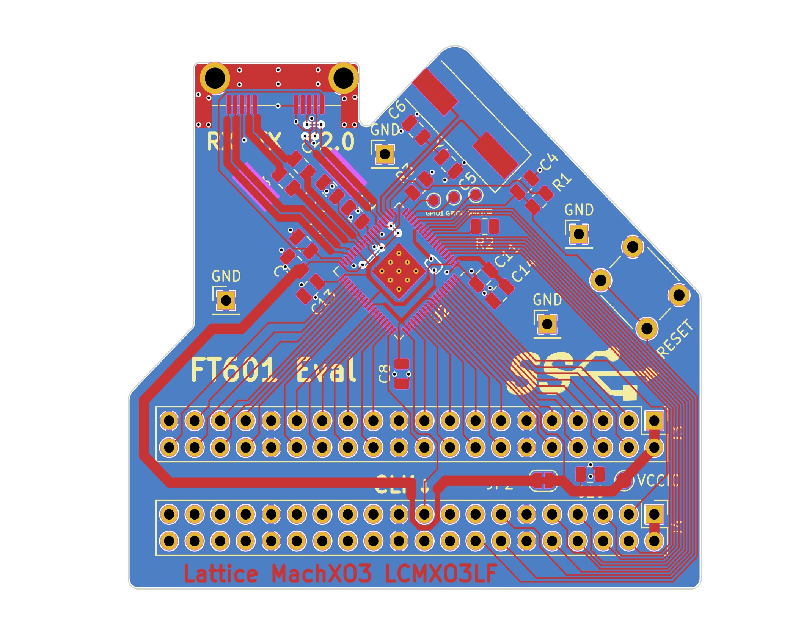
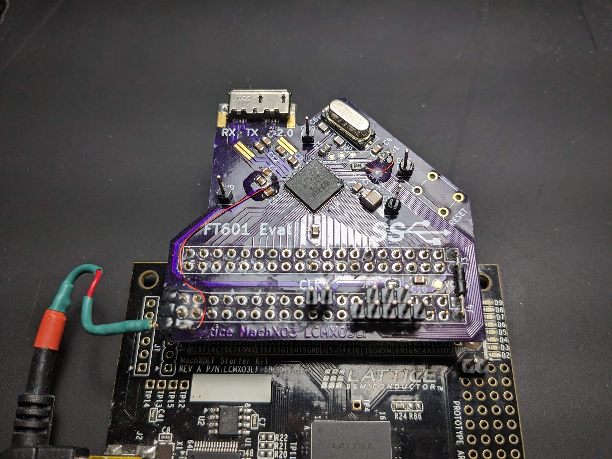

# FTDI FT601 breakout board

A PCB for interfacing FT601 with Lattice MachXO3 Starter Board.
Examples of C driver and Python driver can be found in driver folder.
Verilog and cocotb sims are in fpga folder.

# PCB:

